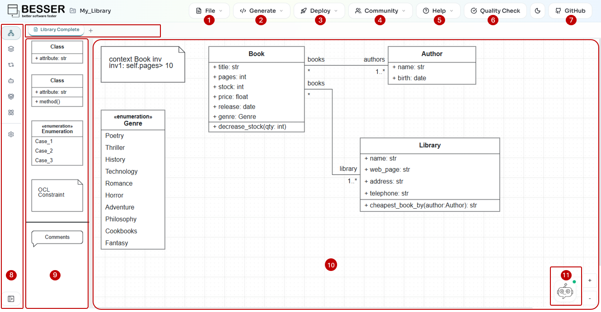

Getting Started
===============

Accessing the Editor
--------------------

You can access the BESSER Web Modeling Editor in two ways:

1.  **Public Online Version**: Visit `editor.besser-pearl.org <https://editor.besser-pearl.org>`_ in your web browser.
2.  **Local Deployment**: Run the editor on your own machine using Docker or from source.

Prerequisites
-------------

*   **For Docker**: `Docker Desktop <https://www.docker.com/products/docker-desktop/>`_.
*   **For Source**: Node.js **20.0.0** or newer, npm 10, and Git.

Deploy with Docker (Recommended)
--------------------------------

The easiest way to run the editor locally is using Docker Compose.

.. code-block:: bash

   git clone https://github.com/BESSER-PEARL/BESSER.git
   cd BESSER
   git submodule init
   git submodule update
   docker-compose up

Once the setup is complete, open your browser and navigate to ``http://localhost:8080``.

Run from Source
---------------

If you want to contribute or modify the code, you can run from source.

Clone and install
~~~~~~~~~~~~~~~~~

.. code-block:: bash

   git clone https://github.com/BESSER-PEARL/BESSER-WEB-MODELING-EDITOR.git
   cd BESSER-WEB-MODELING-EDITOR
   npm install

The project uses npm workspaces. `npm install` resolves dependencies for the
root package and cascades into the ``packages/*`` folders.

.. warning::
   The legacy ``packages/webapp/`` package is **deprecated** and will be removed in
   a future release. All development and deployment targets ``packages/webapp2/``.
   Do not build new features against the old webapp package.

Run the web application locally
-------------------------------

Start the Vite development server:

.. code-block:: bash

   npm run dev

This starts the Vite dev server on http://localhost:8080 with hot-reload for
React components.

.. note::
   Code generation, validation, and BUML export rely on the BESSER backend at
   ``http://localhost:9000/besser_api``. Start it separately from the BESSER repo:

   .. code-block:: bash

      python besser/utilities/web_modeling_editor/backend/backend.py

For production-like testing you can also build and serve static assets:

.. code-block:: bash

   npm run build:webapp2:local
   npm run start:server

The build step outputs static assets under ``build/webapp2`` with
``DEPLOYMENT_URL`` defaulting to ``http://localhost:8080``. The Express
server serves those assets and exposes the diagram REST endpoints on the
same port.

Recommended verification
------------------------

1. Open http://localhost:8080 and create a new Class Diagram.
2. Drag an element onto the canvas and confirm autosave updates the local
   project (check the browser's localStorage entries prefixed with ``besser_``).
3. Export the diagram as SVG from the application bar; the generated file should
   contain the expected graphics.

If the UI fails to load, inspect the browser console and the terminal output
from ``npm run dev`` and ``start:server``. Many runtime issues stem from
missing environment variables—see :doc:`../reference/environment`.
