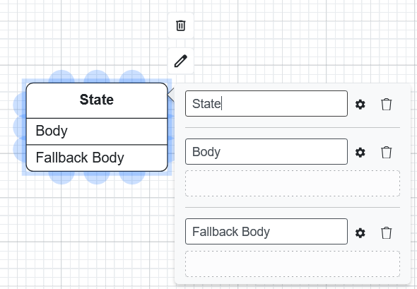
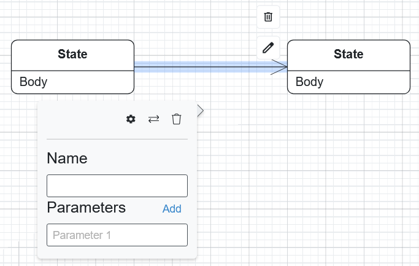

State Machine Diagrams
======================

State machine diagrams model the dynamic behavior of a system by showing how objects change state in response to events. They are particularly useful for modeling reactive systems, user interfaces, and protocol specifications.

Palette
-------

The palette contains elements for creating your state machine diagram:

*   **State** (empty)
*   **State with Body**
*   **State with Body and Fallback Body**
*   **Initial State Node**
*   **Final State Node**
*   **Code Block**

Transitions are created by connecting states directly on the canvas (they are not palette elements).

Getting Started
---------------

States
~~~~~~

To add a state:

1.  Drag and drop the **state** element from the left panel.
2.  Double-click the shape to edit properties.

*   **Name**: The name of the state.
*   **Body**: Define the behavior (actions) of the state.
*   **Fallback Body**: An optional action executed if the state is entered without a specific trigger.

Transitions
~~~~~~~~~~~

To create a transition:

1.  Click the source state.
2.  Drag from a blue connection point to the target state.
3.  Double-click the transition arrow to edit its **Name** and **Parameters**.

Initial and Final States
~~~~~~~~~~~~~~~~~~~~~~~~

Every state machine should have an **Initial State** (the entry point) and optionally
one or more **Final States** (termination points).

*   Drag the **Initial State** element from the palette. Connect it to the first
    meaningful state with a transition.
*   Drag a **Final State** element to indicate where the machine terminates.

Code Blocks
~~~~~~~~~~~

Code blocks allow you to define custom behavior within states using Python code.
Drag a **Code Block** element onto the canvas and double-click to open the code editor.

The code receives a ``session`` parameter for accessing state machine context.

Code Generation
~~~~~~~~~~~~~~~

State machine diagrams do not support direct code generation. They are used as
**method implementations** within Class Diagrams. To generate code that includes
state machine behavior, generate from the Class Diagram that references the
state machine.
