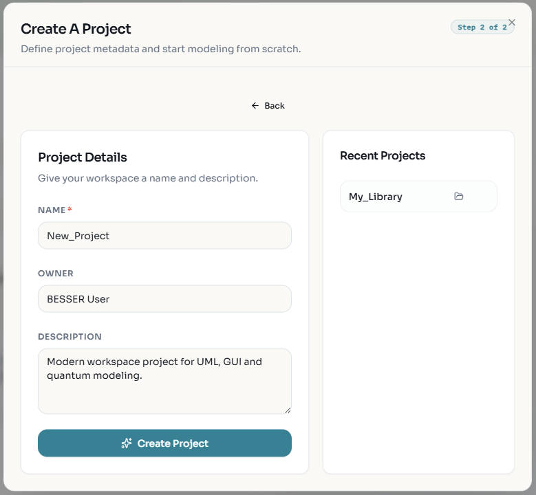
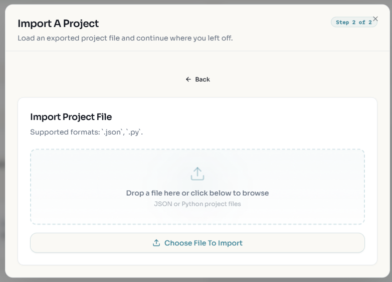
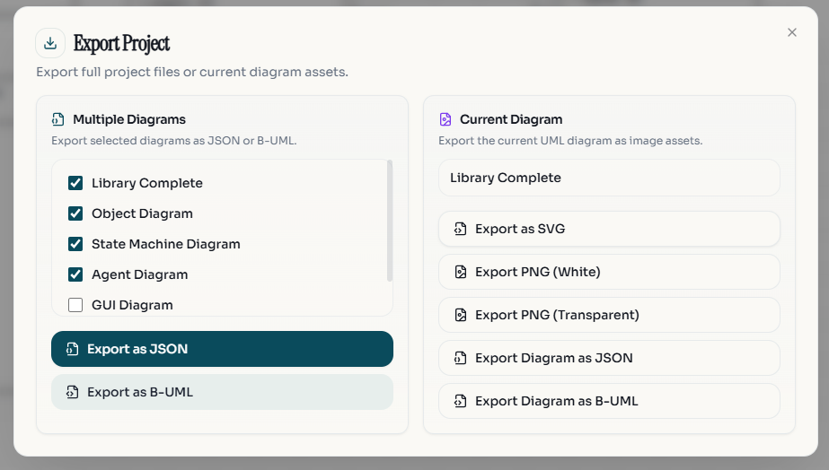
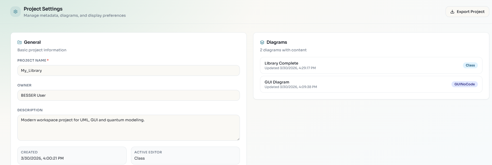

Project Management
==================

The Web Modeling Editor organizes your work into **Projects**. A project acts as a container for all your related diagrams, allowing you to manage complex systems effectively.

Creating a New Project
----------------------

1.  Click the **Home** icon 🏠 or select **File > New Project**.
2.  Enter the project details:
    *   **Name**: A descriptive name for your project.
    *   **Description**: (Optional) A brief summary of the project's purpose.
    *   **Owner**: The name of the project owner.
    *   **Default Diagram**: Select the initial diagram type to start with.
3.  Click **Create Project**.

Importing Projects
------------------

You can import existing projects to continue your work or use templates.

1.  Click **File > Import Project**.
2.  Select the file to import. Supported formats include:
    *   **B-UML (.py)**: The standard Python-based format for BESSER models.
    *   **JSON (.json)**: The internal format used by the web editor.

Exporting Projects
------------------

To save your work or use it with other BESSER tools:

1.  Click **File > Export Project**.
2.  Choose your desired format:
    *   **B-UML**: Exports the model as Python code compatible with the BESSER backend.
    *   **JSON**: Exports the raw editor data.
    *   **Image (SVG/PNG)**: Exports the current diagram visual.
    *   **PDF**: Exports the diagram as a document.

Project Settings
----------------

You can modify project metadata at any time.

1.  Click the **Settings** icon ⚙️ in the sidebar.
2.  Update the Name, Description, or Owner.
3.  View the unique **Project ID**.

GitHub Integration
------------------

The editor supports syncing projects with GitHub repositories, allowing version control
and collaboration on your models.

Connecting to GitHub
~~~~~~~~~~~~~~~~~~~~

1. Click the **GitHub** icon in the left sidebar to open the GitHub panel.
2. Sign in with your GitHub account when prompted. This grants the editor access to your repositories.

Saving a Project to GitHub
~~~~~~~~~~~~~~~~~~~~~~~~~~

You can save your project to a new or existing GitHub repository:

- **New repository**: Click **Create Repository**, enter a name and description, then push. The editor
  creates the repo and commits your project JSON file.
- **Existing repository**: Click **Link Repository**, browse your repos, select one, choose a branch
  and file path, then push. The project JSON is saved to that location.

Each push creates a commit with your project data. The editor also exports raw B-UML Python files
(``domain_model.py``, ``agent_model.py``) into a ``buml/`` directory alongside the JSON, so your
project can be maintained even without the web editor.

Opening a Previously Synced Project
~~~~~~~~~~~~~~~~~~~~~~~~~~~~~~~~~~~~

To reopen a project that was saved to GitHub:

1. Open the GitHub panel in the sidebar.
2. Click **Link Repository** and select the repo and branch where your project is stored.
3. Browse the repository contents and select the ``.json`` project file.
4. Click **Pull** to load the project from GitHub into the editor.

The sync connection is remembered per project. Subsequent pushes go to the same repo/branch/file
without needing to relink.

Commit History
~~~~~~~~~~~~~~

The GitHub panel shows the commit history for your project file. You can click any commit to
restore that version of the project.
